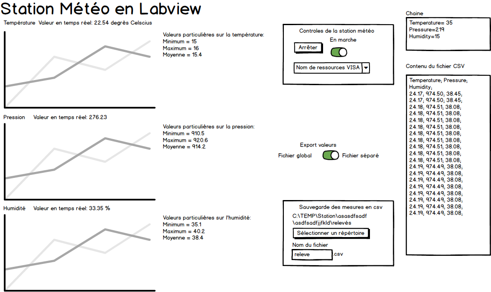

# Liste des fonctionnalités de la station météo
## Station météo réalisé avec Labview dans le cadre du cours MA-05.

### Obligatoires:

1. L'utilisateur peut suspendre/reprendre l'activité de la station au moyen d'un bouton
1. Les trois mesures (température, humidité et pression) sont affichées en temps réel (rafraîchissement toutes les 5s)
1. Les trois mesures sont affichées dans des graphiques
1. Les trois mesures sont enregistrées automatiquement dans un fichier csv. La date/heure (à la seconde) de la mesure doit figurer dans le fichier. L'utilisateur doit pouvoir choisir le nom et l'emplacement du fichier.

### Choisies:

1. Affichage des valeurs minimum, maximum et moyennes des 3 mesures 
1. Affichage des dates/heures de mesures sur les graphes
1. Permettre d'enregistrer les valeurs à la fois dans un fichier global ou dans des fichiers séparés

### Maquette de la face avant:

### Choix des graphiques:
1. Waveform chart: on lui envoit les valeurs seules (donc quand elles arrivent) et il affiche les valeurs avec un espace constant.

1. Waveform graph: on lui donne un tableau de valeur et il dessine d'un seul coup.